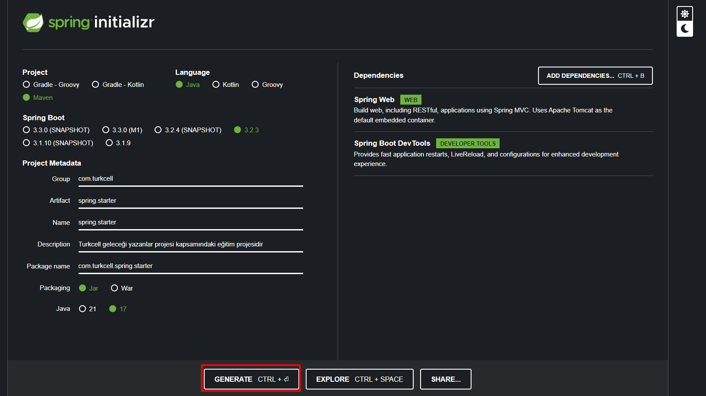

# Kurulum

* `https://start.spring.io`  adresinden  ilgili Dependenci leri ekledikten sonra  install edilen dosyayı  idea da açıyoruz

![[images/test.png]]

* yeni Dependencies eklemek için  `mvnrepository.com` adresinden  ilgili versiyonu seçerek  `pom.xml `de `Dependenciy` kısmına ekleme yaptıktan sonra sağ üstte çıkan `load mavan changes` e tıklayarak sync etmek gerekir.

![[Pasted image 20240226193535.png]]

* spring in default port u `8080` dir bunu değiştirmek için `application.properties` de `server.port` bilgisini belirtebiliriz
  ![[Pasted image 20240226193607.png]]

# Controllers

* bir class ın `controller` olduğunu göstermek için `@RestController` `annatotion` kullanılır

## Annotations

- `@RequestMapping("url")` ile hangi url e cevap vereceğin belirtebiliriz
- 
